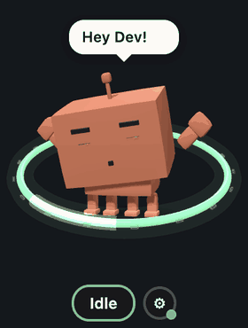
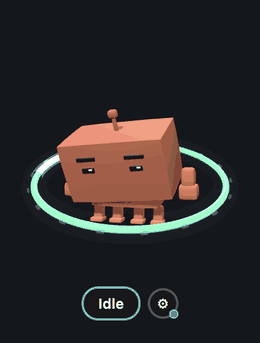
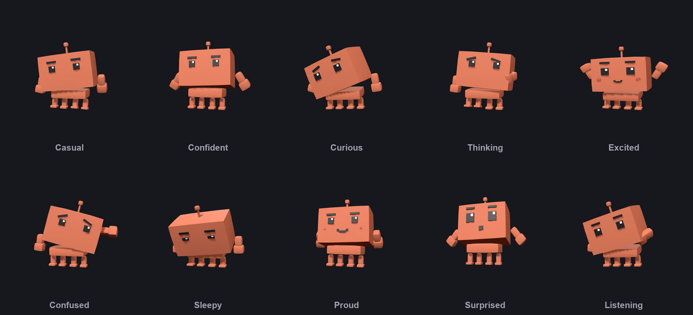
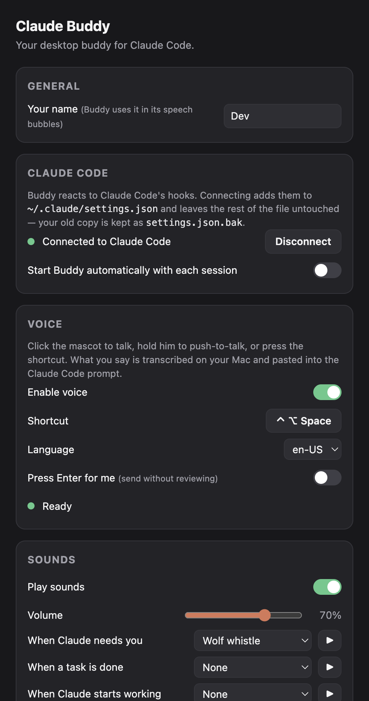

<div align="center">

# Claude Buddy

**A tiny 3D desk companion that shows what Claude Code is doing — and lets you talk to it.**

[](#requirements)
[](https://electronjs.org)
[](https://threejs.org)
[](LICENSE)



He floats above your windows, reacts to every Claude Code hook,
speaks his mind, flashes your LED strip and types what you say
straight into the prompt.

</div>

---

## What it does



Claude Code fires [hooks](https://code.claude.com/docs/en/hooks) as it works. Buddy listens on a local port and turns them into something you can see from across the room.

| State | What he does |
|---|---|
| **Idle** | Floats, looks around, stretches, cracks jokes |
| **Working** | Leans in, thinks, blue ring with comet trails |
| **Needs you** | Freezes, jolts back, waves, whistles, red alarm ring |
| **Done** | Hops, grins, sparkles — then back to idle |

- 🎙 **Talk to him** — click, hold, or hit a hotkey; your words land in the Claude Code prompt
- 💡 **LED strip support** — flash a real BLE light when Claude needs you
- 🔊 **Nine sounds** — pick one per event, or none
- 🎭 **Five moods** — he carries himself differently every few minutes
- 🔒 **Fully local** — speech never leaves your Mac, the server binds to `127.0.0.1`

<br clear="right">

## Requirements

- **macOS** (Apple Silicon or Intel) — voice and the LED layer are macOS-only
- **Claude Code**
- To build from source: **Node 18+** and **Xcode Command Line Tools** (`xcode-select --install`) for the speech helper

## Install

### Download the app

Grab the latest `.dmg` from [**Releases**](https://github.com/SharbelKalloumah/claude-buddy/releases) — `arm64` for Apple Silicon, the plain one for Intel — and drag **Claude Buddy** to Applications.

The app is **not signed with an Apple Developer certificate**, so macOS will refuse to open it the first time. Clear the quarantine flag once:

```sh
xattr -dr com.apple.quarantine "/Applications/Claude Buddy.app"
```

Then open it normally. (Or open it once, then allow it under System Settings → Privacy & Security.)

Finally, click **⚙ → Claude Code → Connect** to add the hooks, and **Voice → Grant access** for the microphone.

### Run from source

```sh
git clone https://github.com/SharbelKalloumah/claude-buddy.git
cd claude-buddy
npm install          # also builds the speech helper
npm start
```

Connect it to Claude Code from the command line if you prefer:

```sh
node scripts/merge-hooks.js --dry-run   # preview the change
node scripts/merge-hooks.js             # back up settings.json, then merge
```

Either way, the hooks go into `~/.claude/settings.json` and **nothing else in that file is touched** — your original is kept as `settings.json.bak`. Start a new Claude Code session and he'll begin reacting.

> Run him in the background with `npm run launch-buddy`. Drag him anywhere by holding and moving the mouse. Right-click the label for **Always on top**, **Sound**, **Settings** and **Quit**.

## Talk to him



Click the mascot to start talking, **hold** him to push-to-talk, or press **⌃⌥Space** from anywhere — even while your terminal is focused. What you say is transcribed on-device and pasted into the Claude Code prompt, ready for you to review and press Enter.

First-time setup:

1. **Dictation on** — System Settings → Keyboard → Dictation. Apple's offline speech models only load when this is on.
2. **Permissions** — Settings → Voice → **Grant access** (microphone, then Accessibility so he can paste).

Speech runs through Apple's on-device recogniser via a small Swift helper in [`native/`](native/stt.swift). Nothing is uploaded and there is no model to download. Fourteen languages are supported.

## Settings



Open with **⚙** next to the label, or right-click → Settings. Everything saves as you change it.

- **General** — your name, which he uses when he talks to you
- **Voice** — shortcut, language, whether he presses Enter for you
- **Sounds** — a sound per event, with volume and previews
- **LED lights** — connect, manual colour and brightness
- **When to light** — a pattern per Claude state, with a live preview
- **Supported LEDs** — what hardware works

<br clear="right">

## LED strip (optional)

Buddy drives **BJ_LED_M** Bluetooth LE controllers (the ones sold with the *bojiaLED* app). Pick a pattern per state — *Off*, *Solid colour*, *Pulse*, *Blink* or *Police lights* — and the strip follows Claude.

```sh
npm run led:probe                        # find your controller, list its services
npm run led:probe -- --send off,on,red   # send test commands
```

Details, verified command bytes and how to add another controller: [`docs/HARDWARE.md`](docs/HARDWARE.md).

## How it works

```
Claude Code hooks ──curl──▶ 127.0.0.1:7788 ──▶ main process ──┬──▶ widget (three.js mascot)
                                                              ├──▶ LED controller ──▶ BLE strip
                                                              └──▶ speech helper ──▶ paste
```

```
src/main/              windows, state server, settings, lighting rules, voice
src/main/led/          BLE protocol, transport, controller, patterns
src/preload/           context bridges (contextIsolation on, no Node in the pages)
src/renderer/widget/   the mascot: rig, poses, moves, moods, ring, speech bubble
src/renderer/settings/ the settings window
native/                on-device speech helper (Swift)
scripts/               launcher, hook installer, LED probe
test/                  run with `npm test` — no hardware needed
```

The mascot is a rigged voxel character: a big head on a flexible neck, eyebrows, a springy antenna with real spring physics, oversized hands, squash-and-stretch and dust puffs on landing. A behaviour engine (`mascot/brain.js`) blends poses, plays signature moves — head bob, peek, shrug, spin, look back, stretch, wiggle, side step, freeze — and runs idle routines in one of five moods. His jokes live in the `QUIPS` list in `renderer.js`, where `{name}` becomes your name.

## Hook reference

| Claude Code event | State |
|---|---|
| `SessionStart` | idle |
| `UserPromptSubmit`, `PreToolUse`, `PostToolUse` | working |
| `PermissionRequest`, `Notification` | needs you |
| `Stop` | done |

Each hook runs a one-second `curl` that fails silently, so Claude Code never blocks or errors when Buddy isn't running.

Test by hand:

```sh
curl -X POST http://127.0.0.1:7788/needs_input
curl -X POST http://127.0.0.1:7788/idle
```

Change the port with `CLAUDE_BUDDY_PORT=7799 npm start` and a matching `{ "env": { "CLAUDE_BUDDY_PORT": "7799" } }` in `~/.claude/settings.json`.

## Development

```sh
npm test               # protocol, transport, patterns, settings, lighting, mascot behaviour
npm run build:native   # rebuild the speech helper
npm run dist           # build the .dmg and .zip installers into dist/
```

Builds are ad-hoc signed, since there is no Apple Developer certificate. If you have one, drop the `identity` and `hardenedRuntime` overrides from the `build.mac` block in `package.json` and electron-builder will sign and notarize properly.

## Uninstall

```sh
node scripts/merge-hooks.js --remove   # removes only Buddy's hooks
```

Then quit the widget and delete the folder. Your original `~/.claude/settings.json` is kept at `settings.json.bak`.

## License

[MIT](LICENSE) — do what you like with it.
